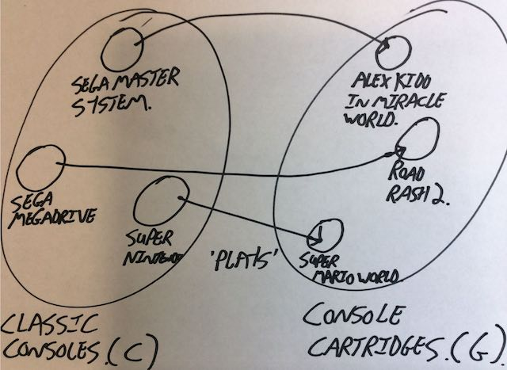
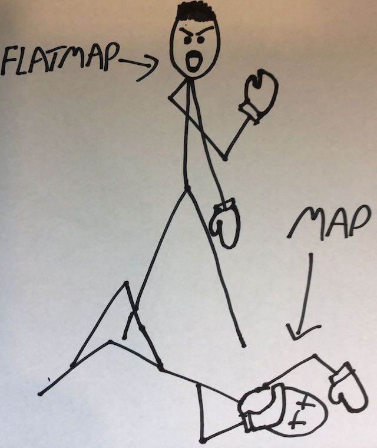

# Category Theory in Functional Programming 101 Dojo
A crash course in the basics (taught by a learner driver).

## Introduction
Functional programming (FP) has been around for a long time. Recent findings have revealed that the T-Rex probably programmed in Lisp.
During this time, the set of core concepts associated with FP has remained reasonably constant. These concepts are strongly rooted in [lambda calculus](https://en.wikipedia.org/wiki/Lambda_calculus), which is a branch of maths primarily concerned with the application of functions - their composition; higher-order functions; currying etc. Essentially *functional programming is lambda calculus*.

Recently though, concepts from another area of mathematics have increasingly become prevalent in the FP-scence: Category Theory (CT).
We work in an industry that is subject to swings in what's fashionable and CT concepts are most certainly bang-on-trend at the moment, to the point where CT is sometimes overstated as is if it's an integral part of what defines the FP paradigm.
I wouldn't go that far. FP is still at its core about functions and their interactions, just as it's always been. Instead, CT concepts provide us with a number of approaches that build on top of normal FP and allow for some really slick solutions to many common problems - they provide the 'Design Patterns' for the functional domain - and for this reason, they're a useful tool have and are here to stay.

**Aside - Skippable Extra Lambda Calculus Notes:**
>See [here](https://medium.com/javascript-scene/the-rise-and-fall-and-rise-of-functional-programming-composable-software-c2d91b424c8c) as a starting point for more detail on the relationship between Lambda Calculus and programming languages. Few interesting nuggets to whet your appetite:
> * The 'calculus' in Lambda Calculus has nothing to do with integration and differentiation that we all know and love. Rather, it refers to the more general meaning of calculus, which defines a 'method or system for calculation or reasoning'.
> * Lisp, that we also all know and love, was heavily influenced by lambda calculus. [Lisp dates from 1958 and is the second oldest prograaming language still in widespread use](https://en.wikipedia.org/wiki/Lisp_(programming_language)), only Fortran edges it out by a year.

Category Theory itself is a vast and *crushingly abstract* field of mathematics. I only understand - or at least have managed to convince myself that I understand - a tiny portion of it.
That's fine though, as my aim here isn't to provide you with a complete exposition into CT, replete with the required mathematical rigour, but instead to concentrate on the application of a few core concepts, without getting too bogged down in the underlying theory.
The goal is that I'll try and present a simplified view of the underlying mathematics: there will be omissions, but what's left should be 99% correct; I hope...  

**Disclaimer:**
>As you've probably picked up on by now, I'm *far* from a CT expert. I learnt about it myself whilst writing this dojo, and have built up a decent inkling as to its application in a programming context, but I'm still lacking a full comprehension of these concepts in a more abstract mathematical sense. Hopefully the vast majority of what I've said here is sound, but don't take it as gospel. I've included copious references you use to confirm / clarify the content, but if you notice any inconsistencies or errors, then flag me up and gladly correct them.

## Dojo Format
The dojo takes a workshop-type format. Generally, for each concept, this document provides a little prose, giving some background to the concept and then there's a few exercises to complete based around it.
These exercises mainly take the format of code that needs writing to make the provided failing tests pass. Initially, all of the failing tests are set to be ignored, so you'll want to un-ignore them as you go along.

You could possibly skip this prose and just do the exercises or vice-versa, but I'd recommend going through it in order. Similarly, it's strongly advisable to ensure that you make all the tests pass before moving on to the next exercise, as they build on each other. If needs be, I've included the answers, so if you get really stuck then just copy the answer and move on.

## Setup
Assuming you work within Scala, then you should be able to skip this section, as getting the tests running is just a question of cloning this repo, opening the code in IntelliJ and then using SBT to run the tests.

**WARNING DO THIS:*
> Assuming you open the project in IntelliJ, then make sure that you tell it to ignore the Solution folder otherwise you'll see some weird behaviour. Right-click on the Solution folder in the project window then  'Mark Directory as' -> 'Excluded'

If you're not familiar with Scala, then the following guide should get you up and running:

* Ensure SBT is installed. If not, install it via:
```
brew install sbt
```
* Ensure the Java 8 **JDK** (not just the JRE) is installed (earlier versions may work, but I've not tested them). It can be downloaded from [here](http://www.oracle.com/technetwork/java/javase/downloads/jdk8-downloads-2133151.html) or installed via brew etc.
* Clone the repo locally:
```
git clone git@github.com:dojonorth/fun-basics-dojo.git
```
* Open the code in your favourite IDE. If you have IntelliJ, then you should just be able to import the build.sbt. At a push, any text editor that lets you navigate the code should be fine.
* Compile and run the tests. If you're using IntelliJ, then it should be easy to do this from there. Otherwise, running the tests directly from the command line is fine. The easist way to check that everything is fine is to navigate to the test root folder and then run:
```
sbt test
```
**NOTE: The first time you run the tests, they'll be slow for a couple of reasons: SBT will have to download and locally cache all of the dependencies and build all of the source code. Subsequent runs should be faster**

Within the cloned directory, the full test suite can be run via:
```
sbt test
```
Individual test files can be run using the following format:
```
 sbt 'test-only uk.co.bbc.dojo.exercise.CodeballSpec'
```

## 1. Categories
**Aside - It doesn't really matter...**
>Before we get started, it's worth noting that I've included this section for completeness: it seemed remiss to talk about CT concepts without first talking about what a category is.
That said, understanding them in detail *isn't actually that important*. It isn't required to understand subsequent concepts.
So read this section and complete the exercises, but if you don't understand it all, don't get hung up on it. Just concentrate on the take-home.

Unsurprisingly, at the heart of category theory, are categories. A category is a 'simple' algebraic data structure that consists of two main collections:
1. **Objects -** the 'things' within the category. These can be thought of as the actual data. They're commonly represented using capital letters e.g. *A*, *B*, *C* etc.
2. **Morphisms -** the relationships within the category. These are mappings go from one source object (A) to another target object (B) and are usually represented using arrows e.g. A → B.

You'll notice that these are incredibly general concepts. Normally, at this stage of explaining something, I'd like to give some concrete examples to help clear things up, but CT really doesn't make this easy.
In fact, CT sets out to describe things in such extreme generality that other entire disciplines of mathematics fall within into it and so  it's sometimes called [Abstract Nonsense](https://en.wikipedia.org/wiki/Abstract_nonsense) by other mathematicians.

I think a lot of the difficulty stems from the fact that, as a developer your preconceptions have probably already lead you to equate objects with types and instances and morphisms with functions, which is generally true when we're applying CT within the context of code.
However, this is a specific application of it and in the more general sense, it operates at a level above the types you're used to dealing with, as we'll see.

The most accessible common example of a category is the *category of finite sets and maps*, although there are [many others](http://eed3si9n.com/learning-scalaz/Examples+of+categories.html).
Within this category an object is a finite set or collection. For example, these sets drawn from my youth:
```
Classic Consoles = {Sega Master System, Sega Megadrive, Super Nintendo}
```
and
```
Console Cartridges = {Super Mario World, Alex Kidd in Miracle World, Road Rash II}
```
We'll call the set Classic Consoles 'C' and the set Console Cartridges 'G', then we can define a morphism:
```
plays: C → G
```
This is all super amenable to being pictographically depicted, so let's do it:



There are a few things to take from the diagram:
* For each dot in the domain of Classic Consoles, there is exactly one arrow that runs to the codomain of Console Cartridges.
* It's missing identity morphisms: CT states that each object should feature a morphism that goes from itself to itself. I haven't bothered to include these. 

In practice we'd have lots of other objects such as:
```
Classic Game Star = {Super Mario, Alex Kidd, Anonymous Biker}
```
If we call Classic Game Star 'S' and assume another morphism 'starring' G → S then we can also infer another morphism from C → S, which is the composition of plays and starring. This concept of composition is at the core of categories. If we have A → B and B → C then there must be a corresponding A → C.

Additional restrictions apply to the collection of objects and arrows for them to qualify as a true mathematical category, but we'll skip over these.

**Aside - Category Theory Further Reading**
>I've tried to inline links to the general concepts that the dojo covers as I've gone along. If you're interested in a more complete discussion of parts of category theory that apply to programming though, then I'd single out [this for special mention](https://bartoszmilewski.com/2014/10/28/category-theory-for-programmers-the-preface/). Just looking at the guy's picture at the top of the page you can tell that he *knows* CT! 
If you're after a more accessible, but less thorough, take on most of the material that the dojo covers, then I'd recommend [giving this a go](http://adit.io/posts/2013-04-17-functors,_applicatives,_and_monads_in_pictures.html).
Finally, if you're after a balance between the two [then this is good](http://www.cakesolutions.net/teamblogs/category-theory-patterns-in-scala). As is [this](http://nikgrozev.com/2016/03/14/functional-programming-and-category-theory-part-1-categories-and-functors/).

#### Exercise
At last - something to do! Open CodemonSpec and un-ignore and make pass the tests.

Here we'll establish a basic object and morphism that we'll use within subsequent exercises.

Additional notes:
* Note the basic Codemon trait. It defines an example object. Feel free to add more Codemon instances, but subsequent tests just assume the presence of these three.
* The identity function is a required component of a category. It just returns whatever is passed to it. This could be a method on the Codemon objects, but I've instead chosen to leave it as a freestanding function in the companion object. I've followed this convention of having functionality as companion object methods throughout the exercise as a whole; it's a slightly arbitrary decision, but I feel it represents a more idiomatic approach that highlights the distinction between data and functions. In real-world coding though, I'd tend towards putting functions within the instances themselves as I feel it makes for simpler code and aids discoverability.
* Evolve is a basic morphism we'll add to our category. Create the function as guided by the spec. Note the simplifying assumption that a RaabyChu evolves to itself - this is a little weird, but simplifies subsequent exercises.
* The evolve morphism is a special type of morphism where the domain and codomain are the same. This is called an endomorphism.

#### Take Home
We've touched on what categories are without going into great depth. The question is how do they they relate to programming?
Here's the reveal: when we're developing in a typed language, the class hierarchy itself forms a category within which:
* *Objects are the types - * classes, traits, interfaces et.
* *Morphisms are the relationships between types - * subtyping and functions.

We have our objects - the types. Check. The morphisms - functions and subtypes. Check. And they follow the rules of morphisms. Check. In particular, they compose! For example:
```
class Person
class Adult extends Person
class Russ extends Adult //Questionable... 
```
Then Russ is also a person. Or if we have:
```
def makeList(value: String): List[String] = List(value, value)
def isListEmpty(list: List[String]): Boolean = list.size == 0
```
then we can define:
```
def composition(value: String): Boolean = isListEmpty(makeList(value)) // AKA (makeList _ andThen isListEmpty _)(value)
```

Why is this important? The thing that really matters is that we can show we're in a category. It doesn't matter what the category is. The fact that we're in a category means that category theory applies and so we have access to hundreds of years of hard work mathematicians have put in understanding and formalising a number of useful concepts that we can now freely pillage and use for our own devices!
The concepts that come up is this dojo form a small selection of examples of these (see [this](http://nikgrozev.com/2016/03/14/functional-programming-and-category-theory-part-1-categories-and-functors/) or [this](https://alissapajer.github.io/conferenceslides/craftconf2014/) for more detail).


## 2. Functors
In CT, a functor describes a transformation between two categories. It needs to map every object and morphism between the two and must adhere to a number of mathematical laws.

Normally, when you apply a function to a value, say +2 on an Integer, the behaviour is fixed.
In order to understand functors, we instead need to extend this to the idea of a value within an associated context.
Commonly, this is depicted as the idea of a value within a 'box' that defines the context.
Depending on what this context is, how the +2 function is ultimately applied will change. For example:

* *In a List context:* +2 would be applied to every element in the list.
* *In a Promise (or Future) context:* +2 would only be applied once the value had been evaluated.

The key is that only the context itself understands how to contextually take a function and apply it to its value(s) and this detail is abstracted away from the caller. 

#### Exercise
Open BeginnersCodeballSpec and un-ignore and make pass the tests.

Now, we're going to create a Codeball! Codeballs can either be empty or hold things. They are also functors and so allow us to perform operations on their contents.
The particular Codeball that we're making here is only a beginner's one and so us limited in what it can do. In particular, only able to hold Codemon and perform operations on the captive Codemon that return other Codemon.
In CT terminiology, this make it an endofunctor (a functor that only maps between instances of the same type).

Additional Notes:
* Being able to map across a collection that may contain either something or nothing without having to differentiate between the two cases is a very powerful pattern that allows for the streamlining of programming to single logical pipes that don't feature continuous branching.
* In the exercise the map method is defined on the type itself. I've done this as it's more familiar and is how I'd write it in practice. In future exercises though, I've segregated data and functionality by putting the methods on their respective companion objects.
* Note that calling *EmptyBeginnersCodeball.codemon* has no meaning for the empty codeball and so we have no choice but to throw an exception. In keeping with the Codeball (aka Option) being a box analogy, this is equivalent to our EmptyCodeball being like the Ark of the Covenant from Indiana Jones - you *could* open it if you want, but I wouldn't recommend it... This is a bit of wrinkle in pure functional terms and shows a little of Scala's OO/imperative roots. It's actually what Scala's Option does too, so I think there's no way around it short of replacing the 'get' method with a 'getOrElse(<some value to return if there isn't one present>)' or fold or similar. However, this would make subsequent exercises more long-winded to write, so we'll stick with the anti-pattern for now. 


#### Functors in Type Constructors
The Beginner's Codeball that we created in the previous exercise served to help explain what a functor is. Since it's an endofunctor it cannot convert between types which severely limits its usefulness.
We'll soon deal with that, but first, we need to ensure that we're familiar with the idea of a *type constructor*.
This is a generic type definition that takes a specific type as its parameter.
For example, in Scala Option[T], List[T] and Future[T] are type constructors. So Option[Boolean] is a type, but Option itself is not.

**Aside - Language Feature Imports:**
>The term 'higher kinded' is sometimes used to refer to such types that have one or more 'holes' in them into which other types must be inserted.
The use of these is considered an advanced language feature in Scala and so needs to be explicitly enabled, otherwise we'll get compiler warnings.
Hence, in the examples, whenever I've declared a type constructor with T[_] syntax, you'll also see that I've imported the feature to suppress compiler warnings:
```
import scala.language.higherKinds
```

#### Exercise
Open CodeballSpec and un-ignore and make pass the tests.

We'll now create a new and improved Codeball type. This (non-canon) one can hold anything, but can't operate on its contents, for now...

Additional notes:
* Probably the easiest exercise you'll ever do.
* Spolier: What we're creating here is the simplest possible implementation of what is effectively the inbuilt Option data type. But I'm going to keep on steadfastly pretending that it's something more exciting. Remeber though, it isn't.

#### Functor defintion

With all of this in hand, we are now in a position to better define what a functor is:
```
trait Functor[T[_]] {
  def map[A, B](x: T[A])(f: A => B): T[B]
}
```

We can see that:
* It is a type constructor that is defined for a generic type.
* It features a method that applies a function to a wrapped value and produces a new functor of the resultant type. This is usually called *map*.

In addition to satisfying this interface, there are certain properties that any map method should adhere to. I won't dwell on them, but I'll mention them here for completeness:
* *Identity:* Calling map with the identity function has no effect.
* *Composition:* Assuming two functions f and g, then calling mapping over f then g is the same as applying the composite function g(f(_)) e.g.
```
fa.map(f).map(g) === fa.map(a => g(f(a))
```

**Aside - Functors Further Reading:**
> [This](http://nikgrozev.com/2016/03/14/functional-programming-and-category-theory-part-1-categories-and-functors/) provides a good explanation of functors from basic concepts without going into too much detail.
> A more heavyweight discussion can be found [here](https://hackernoon.com/functors-and-applicatives-b9af535b1440). Or if you want just the bare bones, then look no further than [here](https://tpolecat.github.io/2014/03/21/functor.html).

#### Exercise
Open AdvancedCodeballSpec and un-ignore and make pass the tests.

Now we add functor capability to our Codeball via the AdvancedCodeball object. Unlike before, we can now change the type of the contents of the Codeball.

Additional notes:
* Rather than creating a new type, we'll create this functor against the existing Codeball type constructor. Arguably this is a bit weird, but it saves us having to reimplement the basic container behaviour and lets us concentrate on the newer more interesting functionality we're adding. 

#### Exercise
Open WildCodemonCaptureSpec and un-ignore and make pass the tests.

Here we look at actually applying the functor we've created in anger. This test requires writing a few little helper methods that we'll then chain together at the end. Hopefully their behaviour should be obvious form the test, but if not here a quick outline:
* ```def throwCodeball(randomFunction: () => Boolean): Codeball[Codemon]```: Models us throwing a Codeball in an effort to capture a wild Codemon. Only Rusa are stupid enough to be caught like this and even then, only if we're lucky (which we model via the passed in random function).
* ```def baitTrap(bait: Codemon): Codeball[Codemon] = bait```: This simulates us baiting a trap with another Codemon in a effort to capture a better one. Only baiting the trap with a Rusa will work, in which case, we'll capture a Sikachu. Baiting it with anything else will leave us empty handed. 
* ```def fastEvolveCodemon(randomFunction: () => Boolean)(codemonToEvolve: Codemon): Codeball[Codemon]```: We're not prepared to wait for our Codemon to evolve naturally, so we'll use modern technology to force the issue. If we get lucky with the random function, then we'll end up with a brand new evolved Codemon. If we get unlucky, then the less said about the result, the better (we'll model it as an Empty Codeball here, rather than the hideous freak of nature that we'd get in reality).
* ```def captureLifecycle(randomFunction: () => Boolean): Codeball[Codeball[Codeball[Codemon]]```: Finally, we put it all together. We'll write a method that simulates our budding industry where we try and capture a Codemon, use it to bait a trap and then fast evolve it for a quick profit.

Additional notes:
* As mentioned before, what we've essentially created is the Option data type, albeit with a different name. The Option type allows for the creation of so-called 'walled gardens' where failures are encapsulated within the data type, rather than being a different return type (such as null or an exception).
* The exercise shows how a number of functor calls can be sequenced together to create a single pipeline that also deals with the failure case without the need for any branching logic. In the case of real Options, this might be reading config, where the first function might represent reading from a file, an operation that could fail, followed by using the result of that to determine a URL to read from that also might fail etc.
* The limitations of map are shown towards the end, where the return type of nested calls becomes increasingly nested and difficult to work with, which is a major limitation.
* This style is sometimes called 'railway-orientated programming', whereby there are two 'lines': the good line and the error line that we sometimes switch onto.

#### Take Home
* Functor is a value in context that provides a method - usually called 'map' - that allows a function to be applied to the value.
* The map function should adhere to two general properties: Identity and Composition.
* How the functor applies the function will vary depending on the context. Consider the familiar examples List and Option.

## 3. Monads
> "A monad is just a monoid in the category of endofunctors, what's the probleⅿ?"

And people wonder why this stuff is considered inacessible. Anyhow, monads have a semi-mythical status in computing, in particular for being hard to understand.
During the course of researching this dojo I read a few posts by people freaking out that it was impossible to understand them without a total grasp of the underlying maths, so don't even try. I'm going to try anyway...

As [has been pointed out](https://bartoszmilewski.com/2016/11/21/monads-programmers-definition/) people end to overestimate their complexity, as they conflate the myriad of applications with the concept itself.
A good analogy I read compared them to duct tape: If you tried to describe duct tape in terms of it's applications then you might say things along the lines of:
* "It covers holes in tents"
* "You can make a [wallets out of it](http://www.wikihow.com/Make-a-Duct-Tape-Wallet)"
* "It can fix ducts"
If you just had it described to you in those terms i.e. what it does, then you'd have no clue what it did. Whereas the underlying description of it is pretty simple: it's a waterproof, resilient tape that binds things together; not unlike monads (well, apart from the waterproof tape part...).

Just like how a functor boiled down to something that has a map operation on it, a monad is a type constructor that has two distinct operations on it:
* **Pure -** a method that takes a value of a plain type and puts it into a monad creating a monadic value. This is effectively the monad constructor. It goes by many aliases across the programming world: return in Haskell, unit in Scala, sometimes pure elsewhere, occasionally zero
* **Bind -** a method that performs as per the functor map operation in that it contextually applies the function to the contents of the monad, but then performs an additional flattening step that will be described in more detail later. Again, this operation goes by other names >>= in Haskell and flatMap in Scala.

I prefer the Scala name flatMap, as it describes what the operation does: it maps over the monad's values and then flattens the result. As with functors, just what this flatten operation does is contextual to the monad in question, but in essence it takes any nested instances within the Monad and then 'flattens' them out into a single monad. For example:
* *The List Monad -* List(List(1,2,3), List(4), List(5,6,7)).flatten() would give List(1,2,3,4,5,6,7)
* *The Option Monad -* Some(Some(x)).flatten would give Some(x), whereas Some(None) gives None

In practical terms, a monad is always also a functor, and features a map method, although this is something of a moot point, since, as we'll see, it's possible to describe map in terms of flatMap and pure.

The type signature of monad is:
```
trait Monad[T[_]] extends Functor[T] {
 def pure[A](value: A): T[A]

 def flatMap[A, B](x: T[A])(f: A => T[B]): T[B]
}
```

Looking at flatMap's signature, we can see that the function that is passed to flatMap, must itself return an instance of the monad, as the exercise will show in depth.
We'll go into the benefits of monads later, but even in the two examples listed above, the power of flatMap over map can be seen:
* *The List Monad -* we can now change the number of elements in the list. Using map only allows us to transform the elements, whilst the total number remains the same.
* *The Option Monad -* We can actually change from a Some to a None. Using map only allows for the value within a Some to be altered.

Hence, it should come as no surprise that flatMap is much more powerful than map. This is illustrated by the fact that it's possible to write map in terms of flatMap, but not vice-versa. If the two had a fight, flatMap would win everytime.



As before, be aware that there are additional mathemetical properties that must hold true for a monad, that I'll lightly touch:
* *Left Identity:* Calling pure on a value then applying a a function to the result via flatMap is the same as just applying the function to the value
> pure(value).flatMap(f) == f(value)
* *Right Identity:* Passing pure to flatMap has no effect
> monad.flatMap(pure) == monad
* *Associativity:* calling flatMap on consecutive functions is the same as flatMapping over two functions
> monad.flatMap(f).flatMap(g) == monad.flatMap(value => f(value).flatMap(g))

#### Exercise
Open MasterCodeballSpec and un-ignore and make pass the tests.

Here we create a fully-fledged monad! This one is unusual, in that I've left the tests that 'prove' that our monad satisfies the laws of monads for you to write. I say 'prove' as all I'm expecting is for you to show that they work for some random examples, rather than in a more rigorous sense.

Additional notes:
* The Monad trait dictates that you'll need a map operation. We never actually call it, so you can leave it unwritten if you want or you can delegate to AdvancedCodeball's map method for completeness.
* As we can see from the type, it only makes sense to flatten instances of the same monadic type.
* We now have the ability to change the outer context. A 'Some' can become a None, which was impossible before with just 'map' - all we could do was change the type of what was inside.
* For any given context, you could potentially define multiple monads (or functors), since it's up to the implementor to decide what the 'sensible' implementation is. In practice though, there's usually only one that makes sense.
* Having the flatten operation on the interface isn't a requirement of monad. But it's usually handy to have access to it.

**Aside - Cats:**
>The idea of using category-theory-derived methods as a core extension to the Scala language is something that's been done already. Initially by [Scalaz](https://github.com/scalaz/scalaz), which I'll not expand on further, and more recently (and accessibly), by [Cats](https://github.com/typelevel/cats).
Cats is a huge topic unto itself. If you want to learn about it, I recommend [Advanced Scala with Cats](http://underscore.io/books/advanced-scala/) by Underscore.io, which is now available for free.
>
>It's worth pointing out that within Cats, similar traits exist to the ones that we've created for Monad and Functor. Since they're part of a wider ecosystem in Cats though, they're built up slightly differently.
For example, cats Monad only includes flatMap and not pure, which it gets from extending Applicative. You can take a look at their heirrarchy [here](https://github.com/typelevel/cats/tree/master/core/src/main/scala/cats).
This is in contrast to standard Scala where most (all?) higher-kinded types in Scala feature map and flatMap methods and are effectively Monads (and so also Functors). However, they don't implement any common interfaces that mark them as such - a la the traits we've created.

#### Exercise
Open ImprovedWildCodemonCaptureSpec and un-ignore and make pass the tests.

This is a redux of WildCodemonCaptureSpec, where we use the power and the majesty of flatMap to address its failings.

Additional notes:
* If there was any doubt that map lords it over flatMap, then this should dispel it. Look at flatMap styling on map! It can do everything that it does and more!
* Using flatMap lets us sequence dependent calls as before, except now we're able to keep a handle on the return type, rather than it exploding into a nested mess. 

#### The For Comprehension
This pattern of having multiple flatMap calls, usually followed by a map call to do something with the return type is incredibly common.
So much so, that there exists syntatic sugar for it, the 'for-comprehension' - not to be confused with the ubiquitous 'for loop' that it shares a confusing similarity with.
The for-comprehension performs a flatMap call on each of the '<-' arrow statements with the exception of the final one, for which it just calls 'map'. The return type is indicated by the 'yield' statement.
More detail and the source of the following examples can be found [here](http://docs.scala-lang.org/tutorials/FAQ/yield):

For example:
> for(x <- c1; y <- c2; z <- c3) yield {...}

gives:
> c1.flatMap(x => c2.flatMap(y => c3.map(z => {...})))

##### Exercise (OPTIONAL)
Open ImprovedWildCodemonCapture and rewrite the series of flatMap calls as a 'for' comprehension.

Additional notes:
* You'll need the map and flatMap methods on the actual class instance instead of in the companion object for this to work. Feel free to just write implementations that delegate to the companion object methods.
* The for-comprehension also supports additional behaviour such as if statements. If you add this, then you'll need to include additional methods filter or withFilter.
  
#### Monad Usage
There are lots of useful monads out there. Throughout the dojo, we've focused on Option and mentioned List and Future several times. A few other mainstream moands that are worth knowing about (and that the cats library provides default implementations of) include:
* *Identity:* Dreary, but useful. The identity monad simply wraps a value into a monad. Unlike all other monads, it doesn't add any special behaviour, but it does let you trivially wrap a value, so you can use it in a context that expects a monad. 
* *Either:* The Either monad allows you to encapsulate two values, one of which represents a success case and one of which represents a failure. There's a interesting discussion on this in the [Pink Book](http://underscore.io/books/advanced-scala/). Essentially, it didn't used to be a monad until Scala 2.12, when it became **biased** - the right side was given the semantics of being the correct value, which allowed for map and flatMap to be defied on it.
* *Eval:* Provides an abstraction layer over a function that allows us to control when it is evaluated. This may be immediate (like val), on read (like def), or evaluated cached after the first use (like lazy val).
* *Writer:* Allows us to associate a continuous log with computations. This is particularly useful in the case when we're producing a log across across multiple concurrent threads, whereby traditional logging techniques run the risk of interleaving messages. 
* *Reader:* Used to compose operations that require some single dependency. The typical usecase is some configuration object that is needed in multiple areas. The reader can be used to compose all the dependant operations into one composite operation that we can then pass the configuration to and will execute in order. In essence, this gives us a form of basic functional DI.
* *State:* The state monad is similar to the reader monad, but instead of being limited to reading from a dependency, in this case, the state, it also allows for it to be altered. The power of the monad comes from the ability to then combine multiple state monads that each represent atomic operations on the state then and seamlessly convey the changing state object between them. This provides a way of encapsulating mutation in a functional way.

You can find much more detailed explaanations on these monad types in these places:
* [The Pink Book](http://underscore.io/books/advanced-scala/): Detailed listings for these monads, with an emphasis on Scala and Cats.
* [Writer, Reader and State](http://adit.io/posts/2013-06-10-three-useful-monads.html): Some nice pictographic examples for these three monad types.
* [The Haskell Wiki](https://wiki.haskell.org/All_About_Monads): As you might expect, the focus is on Haskell, but regardless, it features a pretty comprehensive monad listing, along with an overview, definition motivation and example for each.

#### Exercise (OPTIONAL)
Open CodeboxSpec and un-ignore and make pass the tests.

This is an optional (read: bit rough) additional exercise to implement a different monad - essentially a list Monad by any other name.
You can test drive the whole thing yourself or you can go off of the tests that I've included. If you do choose to follow the tests, then be warned that it's a bit more fast and loose than everything that's come thus far. It's actually just a piece of code that I salvaged from an earlier version of this dojo and so is a bit rough around the edges. Notably, I've left map and flatMap on the instance and I've not implemented any interfaces that define monadic behaviour.

Additional notes:
* Depending on the time you have you could implement a list from scratch or piggyback on top of the existing list type. If you go for the piggyback option, then don't just delegate to the existing list's map/flatMap methods!
* This exercise provides more evidence of the limitations of map as compared to flatMap. Using only map, there is no way to change the number of elements in a List. It is only possible to modify the type or value of the available elements, but the number of elements will remain the same.

### Sequencing the Heart of the Monad
The way that this dojo has approached the Codeball, aka Options, has put a lot of emphasis on the 'flatten' operation - the ability for monads to reconcile a level of nesting into a single flat structure. Taking this tact, hopefully made for an easier introduction and helped better couch the exercises. It is true that all monads will perform some sort of internal flattening (it's a consequence of the Right identity law) - although they may not actually expose it - however, it'd be a mistake to come away thinking that this is the essence of how to think about them.

We saw with the ImprovedWildCodemonCaptureSpec exercise how when we make multiple calls to flatMap, they execute each in order and then are flattened out in reverse order once all of the functions have executed. This behaviour hints at the defining behaviour that people talk about when they're discussing monads which is actually *their ability to sequence computations*.
When you combine monads with flatMap, you're specifying an execution order. FlatMap always has to deal with this along with handling some extra complexity that is the defining charcteristic of the particular monad you're dealing with. This extra behaviour is commonly called the monad's 'effect'. Examples include:
* *Option:* The effect is that it models a sequence of operations that may fail.
* *Future:* The effect is that the operations may be executed asyncronously in different computational contexts.
* *Reader*: The effect is that a provided parameter is made available to all the operations.

#### Take Home
* A monad is a value in context that provides methods to convert a value into a monad - usually called 'pure' - and that allows a function to be to the value applied that itself returns a monad - usually called 'flatMap'.
* As monads are also functors 'map' will also be available.
* A monad must adhere to three laws: Left Identity, Right Identity and Associativity.
* Ultimately, monads are just the sum of the interface and the monad laws, but the implications these laws is hard to reason about and leads to them instead being associated wth other simpler abstractions, the most common being the emphasis on them as a tool for sequencing operation.
* Combining monads with flatMap defines sequencing and introduces some additional effect that is the particular monad's defining characteristic.

#### Exercise (OPTIONAL)
If you've made it this far then I have nothing left to teach you. However, there's always more to learn. I'd recommend running through chapter 4 in the [Advanced Scala with Cats Book](http://underscore.io/books/advanced-scala/) and doing some of the exercises based around the Cats implementations of various monad types.
